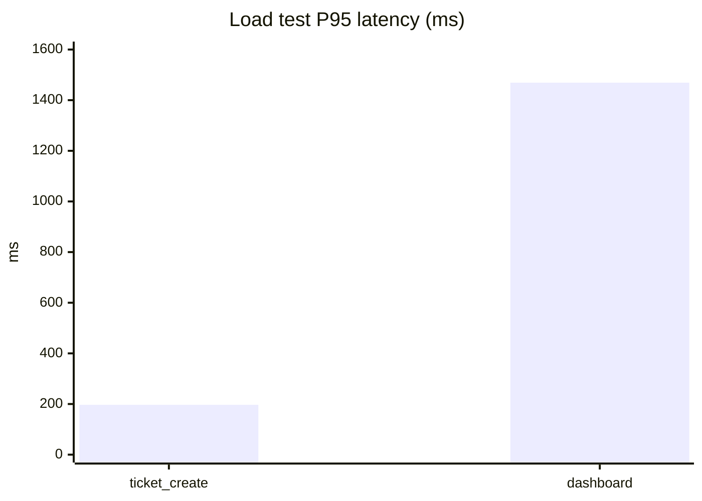
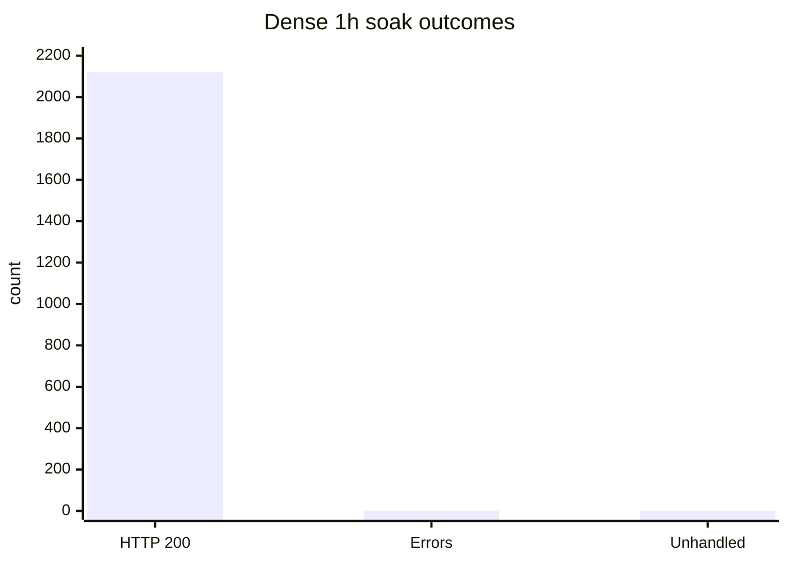

# Sahaya TEST — Final Production Readiness (Phase F)

**Environment:** TEST only (`https://test-sahaya.pariskq.in` / `https://api.test-sahaya.pariskq.in`)  
**Develop SHA (tooling):** `aa69b75`  
**Date (UTC):** 2026-08-03  
**Scope:** Validation only — no production changes, no real Supabase, no RDS, no architecture redesign  

---

## Executive summary

The TEST stack (Local Auth → Prisma → EC2 Docker PostgreSQL → TEST S3) is functionally strong: API acceptance **76/0**, Playwright **22 passed**, DR restore counts match, session lifecycle **29/0**, dense 1h soak **2121/0 HTTP 200**, load test **0% errors / 0 duplicate ticket numbers**.

It is **not** cleared for production cutover yet. Primary blockers:

1. **Password coverage** — only **4/34** users have `password_hash`; **29 active** users cannot use local auth until migrated.
2. **6–12h soak** — dense **1h** soak passed cleanly; continuous **6h** soak was still in progress (~70 minutes at last poll) with some **401/502** during concurrent ops/PG restart — full wall-clock soak not finished.
3. **Observability** — no Prometheus `/metrics` and no in-repo alerting definitions.
4. **TEST login rate limit** raised to **200**/15m for suite volume — must be **stricter in production**.

### Go / No-Go

**No-Go for production cutover** until password migration completes, the 6h soak finishes with stable error rates, and production monitoring/rate-limit baselines are agreed.

---

## Verdict

**NOT PRODUCTION READY**

---

## Architecture diagram

```text
Browser
  → https://test-sahaya.pariskq.in (static FE)
  → https://api.test-sahaya.pariskq.in (Nginx)
  → PM2 sahaya-final-aws-monorepo-api (:4100)
       ├─ Local Auth (Argon2id, JWT access, HttpOnly refresh, auth_sessions)
       ├─ Prisma → localhost:5436 → Docker sahaya-migration-db (PostgreSQL 18)
       └─ S3 proofs → sahaya-test-fe-proofs (presigned GET)
```

Supabase is **not** in the TEST runtime path (`dbMode: "prisma"`, bundle `@supabase/` hits = 0).

---

## Runtime architecture

| Layer | TEST value |
|-------|------------|
| API process | PM2 `sahaya-final-aws-monorepo-api` |
| Health | `GET /health` → `{ status: ok, dbMode: prisma, auditLogsListFix: 3 }` |
| Tenant guard | `ENFORCE_TENANT_GUARD=true` |
| Proofs | `S3_FE_PROOFS_ENABLED=true`, bucket `sahaya-test-fe-proofs` |

---

## Authentication architecture

- Password hashing: **Argon2id**
- Access token: Bearer JWT (TTL ~900s)
- Refresh: HttpOnly + Secure + SameSite=Lax cookie; rotation with replay rejection verified
- Sessions: `auth_sessions` rows; logout revokes refresh
- Roles exercised: `SUPER_ADMIN`, `ADMIN`, `STAFF`, `FIELD_EXECUTIVE`

---

## Database / Prisma / Storage

- **DB:** Docker `sahaya-migration-db` on host port **5436**
- **ORM:** Prisma singleton (`backend/src/db/prisma.js`)
- **Proofs:** object keys under TEST bucket; comment JSON `proof_storage_paths`; presigned URLs

---

## Session lifecycle (Task 4)

Run: Phase F `session-lifecycle` inside bundle `30818676348`

| Check | Result |
|-------|--------|
| Invalid credentials | PASS (401) |
| Login / me / refresh / logout per role (4 roles) | PASS |
| Post-logout refresh rejected | PASS |
| Refresh rotation + replay reject | PASS |
| Concurrent sessions | PASS |
| Forgot-password endpoint (DRY_RUN) | PASS |
| Signup validation response | PASS (400 missing fields) |
| **Totals** | **29 passed / 0 failed** |

Gaps vs wishlist (documented, not failures): full password-change UI matrix, forced role-change mutation on shared users (skipped to avoid breaking TEST), clock-skew lab not instrumented.

---

## Performance & load (Task 2)

Run: `load-summary.json` via bundle `30818676348`

| Scenario | P95 (ms) | Notes |
|----------|---------:|-------|
| Ticket create | **197** | concurrency 15 × 4 rounds |
| Dashboard | **1469** | heavier aggregation |
| Error % | **0** | |
| Duplicate ticket numbers | **0** | |
| Recommended prod limits | login ≤2 rps/IP; ticket create ≤5 rps; dashboard ≤10 rps; FE proof uploads ≤5 concurrent; keep Prisma pool ≪ `max_connections/2` |



---

## Soak test (Task 1)

### Dense soak (1 hour) — COMPLETE

| Metric | Value |
|--------|------:|
| Label | `soak_dense_1h` |
| Duration | 3600s |
| Interval | 8s |
| Cycles | 221 |
| HTTP OK | **2121** |
| HTTP errors | **0** |
| Unhandled exceptions | **0** |
| Status mix | all **200** |



### Continuous 6h soak — IN PROGRESS (blocker for full Task 1)

| Metric | Value |
|--------|------:|
| Label | `soak6h` |
| Started | 2026-08-03T13:36:03Z (pid 3710673) |
| Last poll | ~4197s (~70 min) elapsed |
| Metrics lines | 143 |
| OK / err (partial) | 1328 / 42 |
| Partial errors | 36×401, 6×502 (overlap with acceptance pressure + PG restart) |
| PG connections (sample) | 6 |
| PM2 memory (sample) | ~146 MB |
| Host mem used (sample) | ~5839 MB |

**Requirement:** 6–12 hour uninterrupted soak — **not yet complete**. Continue monitoring with `phase_f_soak_status`; do not treat partial window as full soak PASS.

---

## Security findings (Task 3)

Run: `security-summary.json` — **14 findings**, **1 OPEN**

| ID | Severity | Status | Title | Fix |
|----|----------|--------|-------|-----|
| SEC-RATE-001 | **Medium** | OPEN | Login rate limiting not observed in 40 attempts | Set production `RATE_LIMIT_LOGIN_MAX` much lower than TEST’s 200 (e.g. 20–30 / 15m) |
| SEC-JWT-001 | Info | PASS | Garbage JWT rejected | — |
| SEC-AUTH-001 | Info | PASS | Unauthenticated tickets denied | — |
| SEC-COOKIE-003 | Info | PASS | HttpOnly+Secure+SameSite | — |
| SEC-REFRESH-001 | Info | PASS | Refresh replay rejected | — |
| SEC-PRIV-001 | Info | PASS | FE cannot create orgs | — |
| SEC-TENANT-001 | Info | PASS | ADMIN list tenant-scoped | — |
| SEC-MASS-001 | Info | PASS | Create ignores status/source mass-assign | — |
| SEC-SQLi-001 | Info | PASS | SQLi-like search no 500 | — |
| SEC-XSS-001 | Info | PASS | No script reflection in login error | — |
| SEC-ENUM-001 | Info | PASS | Uniform login errors | — |
| SEC-PATH-001 | Info | PASS | Proof path traversal handled | — |
| SEC-CSRF-001 | Info | PASS | SameSite=Lax + Bearer design | Confirm Origin checks on cookie mutating routes for prod |
| SEC-SECRET-001 | Info | PASS | Health does not leak secrets | — |

No Critical/High **open** security defects in the automated suite. Rate-limit posture is a **Medium** production config risk.

---

## Password coverage (Task 5)

| Metric | Value |
|-------:|
| Users | 34 |
| With `password_hash` | **4 (11.8%)** |
| Active users | 33 |
| Active with hash | 4 |
| **Active missing password** | **29** |
| Bootstrap login OK | 4/4 role samples |

### By role (active missing)

| Role | Total | With hash | Active missing |
|------|------:|----------:|---------------:|
| SUPER_ADMIN | 2 | 1 | 1 |
| ADMIN | 5 | 1 | 4 |
| STAFF | 8 | 1 | 6 |
| FIELD_EXECUTIVE | 14 | 1 | 13 |
| CLIENT | 5 | 0 | 5 |

### Migration plan

1. Classify inactive/pending vs active (done in `password-coverage.json`).
2. Batch-set passwords for active users via controlled `set-test-password.js` / admin provision (**TEST only**); revoke sessions after set.
3. Verify login per batch; never log plaintext passwords.
4. Deactivate orphan unused accounts.
5. Production: invite / first-login set-password flow — **never copy TEST hashes to prod**.

**Severity:** **High** — blocks claiming “every active user can authenticate”.

---

## Disaster recovery (Task 6)

Run: `30818473578` (`phase_f_dr`)

| Check | Result |
|-------|--------|
| Fresh dump | PASS — `/var/backups/sahaya/acceptance/20260803-133329/...dump` |
| Restore to temp PG18 | PASS |
| Count match (users/orgs/tickets/comments/assignments/sla/audit/sessions/FE) | **PASS all** |
| Live login after backup | PASS |
| Tickets API | PASS HTTP 200 |
| Proof metadata rows | 7 |
| Presign | PASS HTTP 200 |
| Duration | **94s** |
| Rollback notes | Documented in `dr-summary.json` (temp restore first; never restore TEST dumps to prod; S3 independent of PG) |

---

## Observability (Task 7)

| Item | Status |
|------|--------|
| Health endpoint + `dbMode` | PASS |
| Request IDs | PASS (`requestId` / `X-Request-Id`) |
| PM2 process | PASS |
| Docker PG + connection sample | PASS |
| Structured log signal | Present in PM2 stream |
| `/metrics` Prometheus | **GAP** |
| In-repo alerting | **GAP** |

### Production monitoring recommendations

- RED metrics for `/auth/login`, `/tickets`, `/fe/proof`, `/data/sla/*`
- Alerts: PM2 restart loops, PG connection saturation, 5xx rate, disk for Docker volumes
- Centralize PM2 + Nginx logs (CloudWatch/ELK)
- Prisma slow-query threshold (>500ms)
- Synthetic: health + login + ticket list every 1–5 minutes

---

## Final acceptance (Task 8)

| Suite | Run | Result |
|-------|-----|--------|
| Full API acceptance | `30823726898` | **76 passed / 0 failed** (after API recovery) |
| Playwright | `30823828470` | **22 passed**, Verdict PASS |
| API restart | `30823597650` | PASS |
| PG restart | `30823833877` | PASS — counts stable (users 34, tickets 1389), API reconnect OK |
| Transient failure note | `30823591948` | FA failed with **502** while soak + concurrent ops overlapped — recovered after restart; treated as capacity signal, not functional regression |

Proof / SLA / short_description / sparse-create checks reconfirmed PASS on recovered FA.

---

## Remaining risks (by severity)

### Critical

_None open in automated security suite._

### High

1. **Password coverage 4/34** — 29 active users lack local passwords → cannot authenticate after Supabase removal for those accounts.
2. **6–12h soak incomplete** — Task 1 minimum wall-clock not finished; partial window showed 401/502 under interference.

### Medium

1. **TEST `RATE_LIMIT_LOGIN_MAX=200`** — necessary for suites; production must use stricter limits (SEC-RATE-001).
2. **No metrics/alerting package** — operational blind spot for production.
3. **Capacity under concurrent soak + acceptance** — API returned 502 until restart; size instance / pool / rate limits before launch.

### Low

1. Access JWT remains valid until TTL after logout of one concurrent session (by design); document for security reviewers.
2. Signup / password-reset flows only lightly exercised (DRY_RUN on reset).

---

## Blockers checklist

| Severity | Blocker | Required action |
|----------|---------|-----------------|
| High | Password coverage | Migrate/set passwords for all **active** users; re-run coverage until active-missing = 0 (or explicitly deactivate) |
| High | 6h soak incomplete | Let `soak6h` finish; require err rate ≈0 outside planned restarts; attach summary JSON |
| Medium | Prod rate limits | Set production login max ≪ TEST |
| Medium | Observability | Add metrics export + alerts before go-live |
| Medium | Capacity headroom | Load-test on prod-sized host; confirm no 502 under soak+ops |

---

## Safety ledger

| Check | Value |
|-------|-------|
| PRODUCTION MODIFICATIONS | **0** |
| REAL SUPABASE MUTATIONS | **0** |
| REAL SUPABASE CONFIG CHANGES | **0** |
| crm-pariskq WRITES | **0** |
| RDS CREATED | **0** |

---

## Evidence index

| Artifact / run | Purpose |
|----------------|---------|
| `/var/backups/sahaya/phase-f/*` on EC2 | soak/load/security/session/password/obs/dr JSON |
| GH `30818676348` | Phase F bundle (soak start + dense 1h + suites) |
| GH `30818473578` | DR backup/restore |
| GH `30823726898` | Full acceptance 76/0 |
| GH `30823828470` | Playwright PASS |
| GH `30823833877` | PG restart |
| `backend/scripts/phase-f/` | Reproducible validators |

---

## Final verdict

**NOT PRODUCTION READY**
